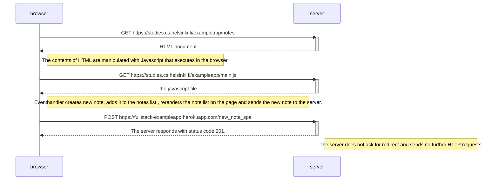

```mermaid
    sequenceDiagram
    participant browser
    participant server

    browser->>server: GET https://studies.cs.helsinki.fi/exampleapp/notes
    activate server
    server-->>browser: HTML document
    deactivate server

    Note right of browser: The contents of HTML are manipulated with Javascript that executes in the browser.

    browser->>server: GET https://studies.cs.helsinki.fi/exampleapp/main.js
    activate server
    server-->>browser: the javascript file
    deactivate server

    Note right of browser: Eventhandler creates new note, adds it to the notes list , rerenders the note list on the page and sends the new note to the server.

    browser->>server: POST https://fullstack-exampleapp.herokuapp.com/new_note_spa
    activate server
    server-->>browser: The server responds with status code 201.
    deactivate server

    Note right of server: The server does not ask for redirect  and sends no further HTTP requests.
    
```